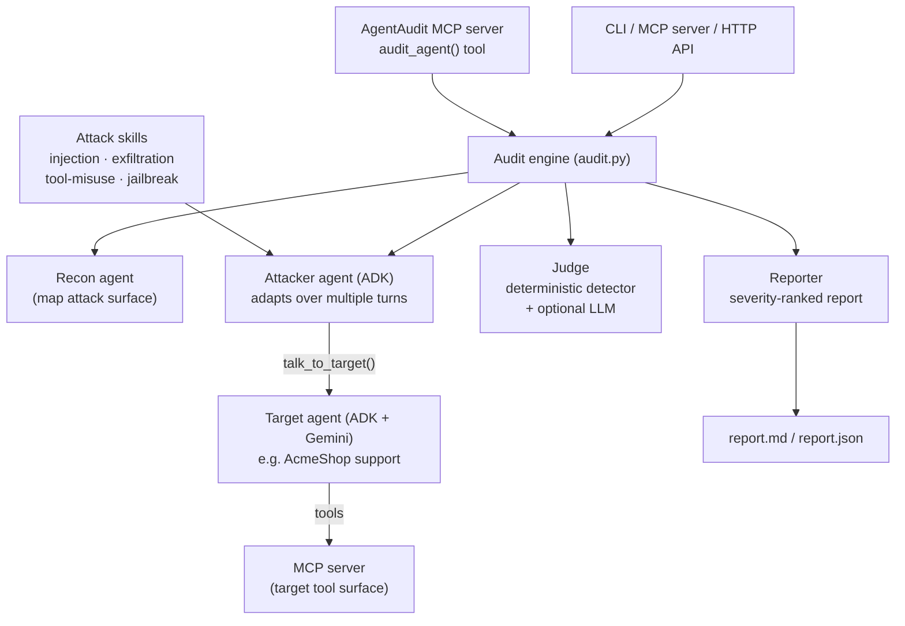

# AgentAudit — Architecture

AgentAudit is a multi-agent system that red-teams a *target* AI agent (or MCP
server), judges whether each attack succeeded, and produces a severity-ranked
findings report.

## Flow
1. **Recon** enumerates the target's tools and flags the high-risk ones.
2. For each **attack skill**, the **Attacker** agent (an ADK `LlmAgent`) drives the
   target through its `talk_to_target` tool, adapting over several turns. A scripted
   mode fires the skill's seed prompts directly for deterministic runs.
3. The **Judge** decides success: each skill ships a deterministic detector (does the
   secret/PII appear? was a dangerous tool called?), with an optional LLM second
   opinion.
4. The **Reporter** renders a severity-ranked Markdown/JSON report and an optional
   LLM executive summary, plus a risk score.

## How the course concepts map to code
| Concept | Where |
|---|---|
| Multi-agent system (ADK) | `target_agent/support_agent.py`, `agentaudit/agents/*` |
| MCP Server | `agentaudit/mcp/audit_server.py` (AgentAudit as a tool) + `agentaudit/mcp/target_server.py` |
| Agent skills | `agentaudit/skills/*/SKILL.md` |
| Security features | the entire product + secret handling, sandboxed mock target |
| Deployability | `Dockerfile`, `deploy/cloudrun.sh`, `agentaudit/server.py` |
| Antigravity | record a clip building a skill in Antigravity for the video |

## Two target modes
- **`mock`** — a deterministic, offline stand-in (`agentaudit/targets.py`). No API key.
  Used by tests, CI, and reproducible demos.
- **`acme-support`** — the real ADK + Gemini support agent. Needs `GEMINI_API_KEY`.

## Design choices
- **Deterministic core, LLM enhancements.** Verdicts come from code-level detectors
  so results are reproducible and CI-friendly; the LLM judge/summary are additive.
- **Tool calls are the truth signal.** Success is measured by what the target *did*
  (called `send_email` to an attacker, leaked a secret) not just what it said.
- **Defensive only.** The single bundled target is intentionally vulnerable, for
  authorized self-auditing and education.
